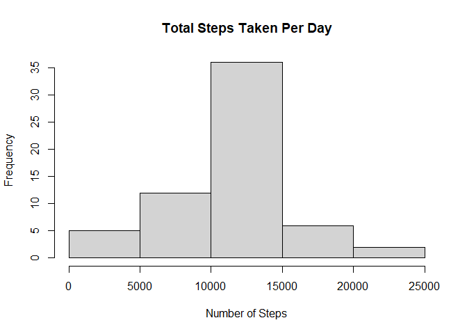
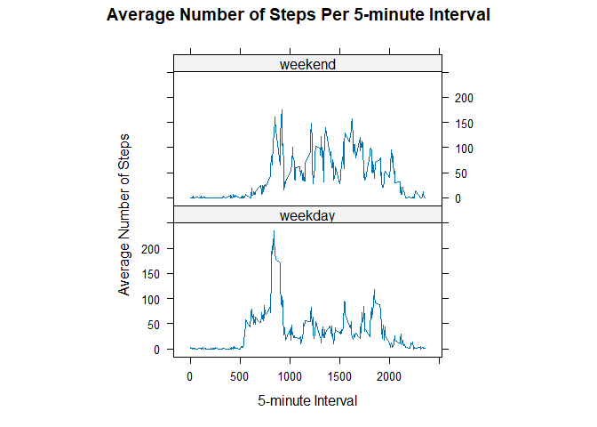

## Loading and preprocessing the data
### Load the necessary packages and the data into a data set


``` r
library(knitr)
library(dplyr)
```

```
## 
## Attaching package: 'dplyr'
```

```
## The following objects are masked from 'package:stats':
## 
##     filter, lag
```

```
## The following objects are masked from 'package:base':
## 
##     intersect, setdiff, setequal, union
```

``` r
library(ggplot2)
library(lubridate)
```

```
## 
## Attaching package: 'lubridate'
```

```
## The following objects are masked from 'package:base':
## 
##     date, intersect, setdiff, union
```

``` r
library(lattice)
activity <- read.csv("activity.csv")
```

### Process/transform the data (if necessary) into a format suitable for your analysis


``` r
activity <- activity %>%
        mutate(date = as.Date(activity$date))
```


## What is mean total number of steps taken per day?
### Calculate the total number of steps taken per day


``` r
total <- activity %>%
        group_by(date) %>%
        summarize(steps = sum(steps))
```

### Make a histogram of the total number of steps taken per day


``` r
hist(total$steps, 
      main = "Total Steps Taken Each Day", 
      xlab = "Number of Steps", 
      ylab = "Frequency", 
)
```

<!-- -->

### Calculate and report the mean and median of the total number of steps per day


``` r
mean <- mean(total$steps, na.rm = TRUE)
median <- median(total$steps, na.rm = TRUE)
```
The mean is 10 766.19 and the median is 10 765.


## What is the average daily activity pattern?
### Make a time series plot of the 5-minute interval (x-axis) and the average number of steps taken, averaged across all days (y-axis)


``` r
ave_activity <- activity %>%
        group_by(interval) %>%
        summarise(steps = mean(steps, na.rm = TRUE))
plot(steps ~ interval, data = ave_activity, type = "l", xlab = "5-minute Interval",
     ylab = "Average Number of Steps", main = "Average Number of Steps per 5-minute
     Interval")
```

<!-- -->

### Which 5-minute interval, on average across all the days in the dataset, contains the maximum number of steps?


``` r
ave_activity[which.max(ave_activity$steps), ]$interval
```

```
## [1] 835
```
The 5-minute interval 835 contains the maximum number of steps.


## Imputing missing values
### Calculate and report the total number of missing values in the dataset


``` r
sum(is.na(activity$steps))
```

```
## [1] 2304
```
The total number of missing values in the data set activity is 2304.

### Devise a strategy for filling in all of the missing values in the dataset and create a new dataset that is equal to the original dataset but with the missing data filled in


``` r
activityNew <- activity
for(i in 1:ncol(activityNew)){
        activityNew[is.na(activityNew[,i]), i] <- mean(activityNew$steps, na.rm = TRUE)
}
```

### Make a histogram of the total number of steps taken each day and Calculate and report the mean and median total number of steps taken per day

First, we need to group and sum up the different groups of data:

``` r
totalNew <- activityNew %>%
        group_by(date) %>%
        summarize(steps = sum(steps))
```

Then, we can make the histogram:

``` r
hist(totalNew$steps)
```

<!-- -->

Lastly, we can get the mean and median of the new data set:

``` r
mean_narm <- mean(totalNew$steps)
median_narm <- median(totalNew$steps)
```

The histogram for data without missing values (totalNew) is different to the histogram for data with (total) in that
The mean for totalNew is 10 766.19 which is the same as the mean for activity
The median for totalNew is 10.766.19 which is slightly higher than the median for activity
The impact of imputing missing data is thus minimal, as it only only affects the median in this case.


## Are there differences in activity patterns between weekdays and weekends?
### Create a new factor variable in the dataset with two levels – “weekday” and “weekend” indicating whether a given date is a weekday or weekend day


``` r
activity2 <- activity
activity2$day = ifelse(as.POSIXlt(activity$date)$wday%%6 == 
    0, "weekend", "weekday") 
```

### Make a panel plot containing a time series plot (i.e. type = "l") of the 5-minute interval (x-axis) and the average number of steps taken, averaged across all weekday days or weekend days (y-axis)


``` r
ave_activity2 <- activity2 %>%
        group_by(interval, day) %>%
        summarise(steps = mean(steps, na.rm = TRUE))
```

```
## `summarise()` has grouped output by 'interval'. You can override using the
## `.groups` argument.
```

``` r
xyplot(steps ~ interval | factor(day), data = ave_activity2, aspect = 1/2, 
    type = "l")
```

<!-- -->
